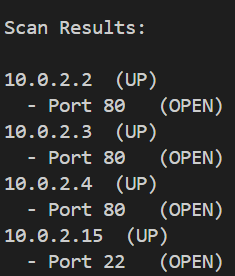

# Port scanner

## Overiew 
This is a network scanner that will detect your active hosts and scans the ports. Only the active hosts will be displayed.

## Features
- I did use multithreading from the original ip scanner to make things quicker so that it will scan about 50 at a time
- The code will scan specific IPs as the user inputs
- I also made it only show the active hosts to make it a little eaiser to read or look at 

## Running the code
To run the code you must be in python
An example of running the code is:
 python3 port.py -n 10.0.2.15/24 -p 1-100
First python3 because then we can run the code in python and then I put port.py because that is the file name or directory. And then I put -n (network) and a givien IP address and I used mine /24 then -p (ports) 1-100. The down hosts wil not be displayed. 

